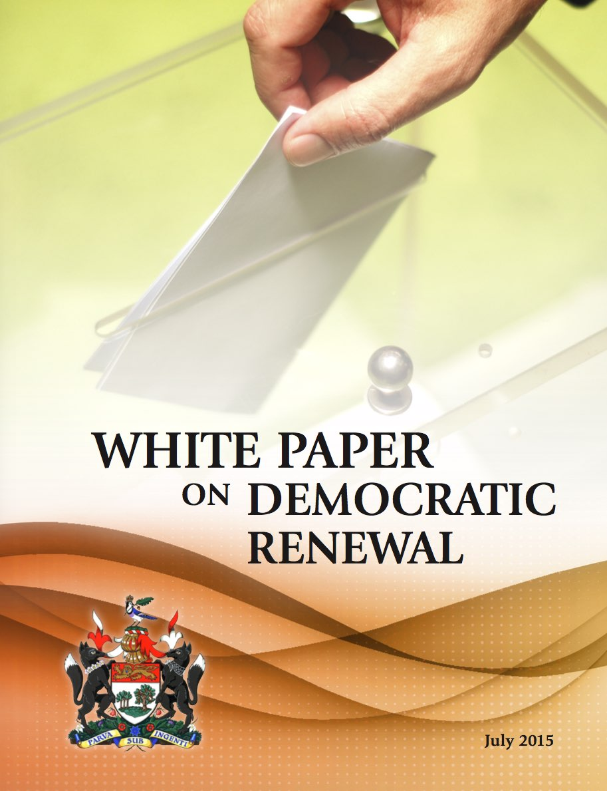

# Democratic Renewal on Prince Edward Island

This repository contains materials related to the discussion of democratic renewal on Prince Edward Island, starting from a white paper released on July 9, 2015.

**This is an unofficial collection of documents, not an official repository.**

## Contents

What you'll find here right now are versions of the *White Paper on Democratic Renewal* in the following formats:

* [ePub](whitepaper/epub)
* [HTML](whitepaper/html)
* [Kindle MOBI](whitepaper/kindle) 
* [Plain Text](whitepaper/txt)

as well as a reference copy of [the original PDF file released by the province](whitepaper/pdf).

These versions were constructed by extracting the plain text from the official PDF file, pasting it into Sigil, and then marking up HTML inside [Sigil](http://sigil-ebook.com/) (with [BBEdit](http://www.barebones.com/products/bbedit/) used for convenience when helpful).  The ePub was saved directly from Sigil; the Kindle version was created using Amazon's web-based ePub-to-mobi convertor, and the HTML version was converted from the ePub using [Calibre](http://calibre-ebook.com/).

